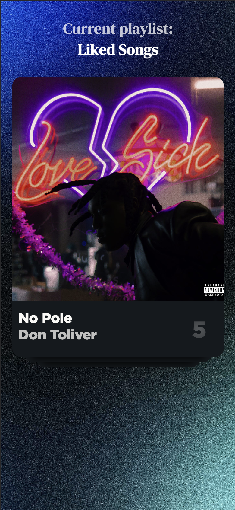

# SongSwipe :musical_note::beetle:

<div align="center">


</div>
SongSwipe will be a mobile web application that allows for a easier, quicker, and more user-friendly experience of cleaning out a Spotify playlist.

## Description

It allows for a simple Tinder-inspired swipe left-or-right motion  to decide whether a song will remain in your playlist or be removed.  Previews of the song will be played automatically.  Not only can a user easily remove unwanted old songs from their own playlists, but also filter out songs from a copy of another users playlist to make it more personal to the user.

<p align="center">
    
</p>

## Feature Plans
### Core Features:
- Swiping mechanic
- Staging area for left and right swipes
- Options to remove from playlist, move to a new playlist, etc. for staging areas
- Preview tracks playing automatically
- Song, album, artist info display

### Stretch Features:
- YouTube API translation layer
- Desktop version (Shouldn't be too hard)
- Playlist discoverer from other people to copy, filter and save other peoples playlists
- Pretty animations would be nice
- Undo button
- **Settings Options:** 
    - Light / Dark Mode / Themes
    - Language select would be nice
    - Font Size
    - Preview length tweaking

## Getting Started

The following steps will allow you to run SongSwipe locally on your machine. Before beginning you must have `node` and `npm` installed on your computer. If you have `git` installed, the following command can clone the project. You also will need to create an application on the [Spotify Developer Portal](https://developer.spotify.com/).
```
git clone https://github.com/ListenToAJ/SongSwipe.git
```
### Dependencies 

Installing the dependencies for the project is simple. After cloning the project, enter the root of the project directory and simplely run:
```
npm install
```

### Installing & Setup

You need to provide a `.env` file with some information in order for the express app that acts as our backend to run. The redirt URIs may need to be adjusted depending on what you use to run it. The redirect URI that is used for auth must also be provided as a redirect URI on the Spotify Dev Portal. 
```
SPOTIFY_CLIENT_ID=<YOUR SPOTIFY CLIENT ID>
SPOTIFY_CLIENT_SECRET=<YOUR SPOTIFY SECRET>
REDIRECT_URI_AUTH=http://127.0.0.1:9000/.netlify/functions/api/auth/callback
REDIRECT_URI_HOME=http://127.0.0.1:8080/playlists.html
```
You may also need to edit the second line of `dist/playlist.js` at the moment as well due to the URI for API calls being hardcoded at the moment. 

At the current moment our application requires a server that is distributing the `dist` directory of the project to be able to function. This is to emulate what is eventually going to be hosted on netlify. Our dependencies include the `http-server` node module that can be used for this however, if it does not work you can install it with the following command.
```
npm install http-server
```
Editors like Visual Studio Code also have extensions that can provide a live http-server. If you decide to use something like that instead make sure you update the URIs accordingly. We will attempt to make this a more streamlined thing for running locally as the project progresses.

### Running Locally

Once dependencies are installed and the `.env` file is created and populated you can run the application with either of the following commands.
```
npm start (will just run the backend express app, use if you plan to use your own http server to distribute the frontend)
npm run dev (will launch both a server to distribute the frontend and execute the backend)
```
At the current moment we do not have a landing page set up so to check out what we have for the application you can go to either of these urls. Please note port `8080` is the default port for `http-server` and port `9000` is the default port for the express backend so if you decide to change them make sure you update the urls accordingly. 
```
http://127.0.0.1:8080/index.html (song swiping demo, mobile only)
http://127.0.0.1:9000/.netlify/functions/api/auth/login (will ask you to sign in then redirect you to the work in progres playlist selection screen)
```

Our unit tests can be ran with the following command.
```
npm test
```

<!-- 


* In order to compile you will need to hard modify the makefile to link to your installation of SFML.


* Compile with Makefile first.


* Notes on running / executing the program, possible information on how variables may need to be setup on a non-final build.  If no code is needed, explain that.
```
python3 runmyprogram.py
```

## Future Plans (OPTIONAL)

If there are any future plans for the future of the project, write and note them here.  This will show both users and yourself that you are not done, and it can be improved. -->

## Authors
- Christopher Coco
- Raj Ray
- Anthony Simao
- Katiana Sourn
- Nena Heng


## Version History
- 0.0
    - We have nothing

## License

© 2025 Christopher Coco, Raj Ray, Anthony Simao, Katiana Sourn, Nena Heng
All rights reserved.

## Acknowledgments
